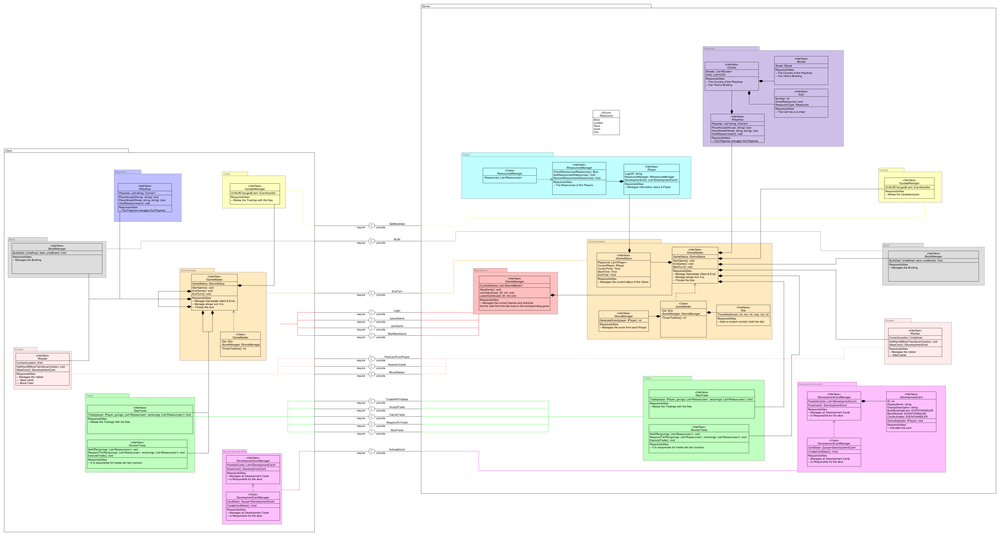

Architektur
===========
Alain Keller, Pascal Honegger, Marc Keller 
Version 1.2, 29.01.2016
:toc:

= Allgemeine Funktionen

== Benutzer
Der Benutzer meldet sich über den Client an. Die Anmeldedaten werden auf dem Server verifiziert. Des Users Daten werden in der Datenbank gespeichert. Die Userdaten werden zentral gespeichert, damit man sich von überall verbinden kann.

== GUI
Das Gui wird bei jedem User lokal initialisiert. Die Daten, was, wo angezeigt wird, kommen vom Server. Der im Client verwendete Text ist lokalisert (Detusch & Englisch). 

= Komponenten
Wir haben die Komponenten nach unseren Use Cases gemacht. Wir hielten es für Sinnvoll, da sie von einander abgetrennt sind, aber trotzdem miteinander kommuniziern müssen.
== Ressourcen Verwaltung

=== Spieler
Der Spieler 

==== Server
Die Daten des Spielers werden serverseitig verwaltet. Dieser ist verantwortlich,  dass die Spieler ihre Daten und die des Gegners in richtiger Form bekommen.

==== Client
Die Ressourcen werden zusätzlich auf dem Client verwaltet, um unnötig viele Serveranfragen zu vermeiden. Sonst werden hauptsächich die Daten der Spieler im GUI angezeigt. Das meiste, was auf dem Server lauft wird auch auf dem Client implementiert. Somit können wir schon auf dem Client validierungen machen. Diese werden auf dem Server nochmals durchgefürht, da auf dem CLient die Validierungen umgegangen werden können.

== Handeln

== Bauen

== Würfeln

== Räuber

== Spielfeld
Da das Spielfeld aus mehreren verschiedenen Teilen besteht mussten wir uns Gedanken darüber machen wie wir diese zu einem Feld zusammenbringen. Wir haben uns dafür entschieden den Eckpunkt als zentrales Element zu nehmen, da jeder Eckpunkt seine angrenzenden Feldern und Strassen kennen muss. Dies lösen wir, indem wir in jedem Eckpunkt seien Angrenzenden Felder speichern. Somit kann man z.B. beim Bauen ermitteln, ob schon eine Strasse zum Punkt führt oder nicht. Die Gebäude und Räuber werden dann den Feldern/Punkten zugewiesen und können somit über das Spielfeld deren Daten ermitteln.
Die Methoden PlaceHouse() und placeStreet() wurden getrennt, da die Methoden verschiedene Parameter brauchen. include::Architektur.adoc[]

== WebSerices
Um die Client-Server Kommunikation zu ermöglichen braucht es Webservices. Diese teilen wir auf die verschiedenen Kompnenten auf, damit diese nach Komponenten geordent implementiert werden. Somit ist es in Zukunft einfacher diese zu erweitern.