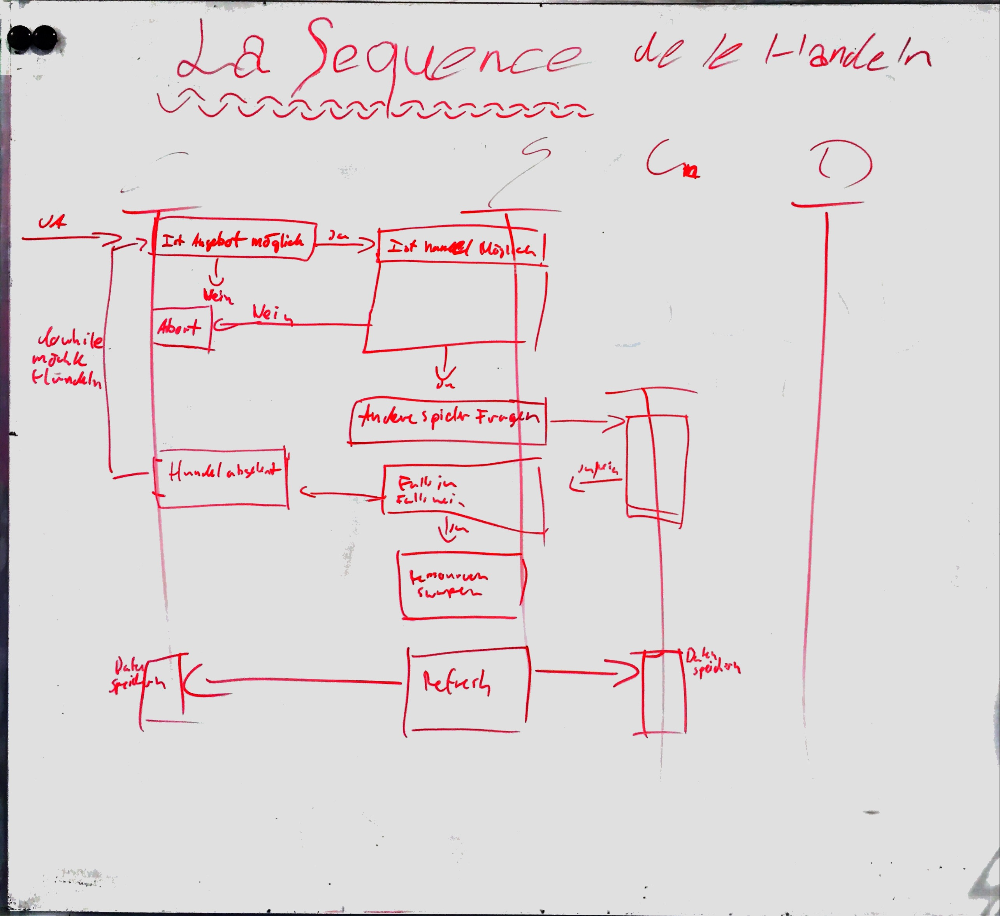
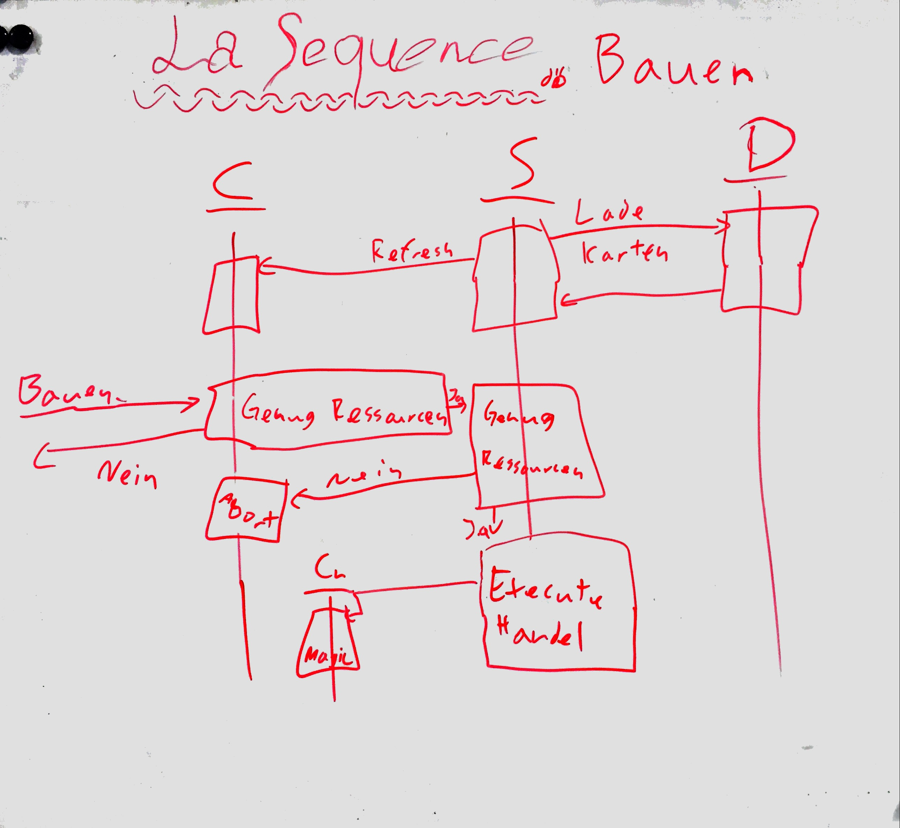
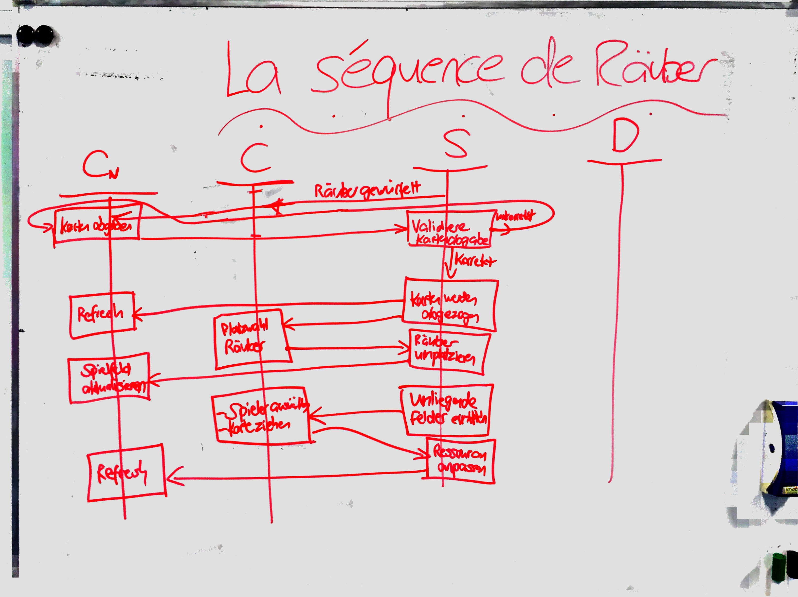

Dokumentation
=============
Alain Keller, Pascal Honegger, Marc Keller 
Version 1.2, 08.01.2016
:toc:

== Framework

=== C#
Wir werden C#6 / .net 4.6.1 verwenden.

=== Java
Wir werden Java 1.8 benutzen.
 
== Architektur Dokumentation

.Welche Komponente wird wo berechnet
[width="100%",options="header",cols="1,2,2,2"]
|======================
|Komponent
|Client Berechnung
|Server Berechnung
|Datenbank

|Gamemaster
|Grafische Darstellung
|Würfeln ; Wer ist am Zug ; Spiel starten ; Ressourcen verteilen
|Spiel ; Teilnehmern ; Statistiken Teilnehmer (Platzierung, übrige Ressourcen) ; Startressourcen

|Spieler
|Ressourcen GUI ; Handeln GUI ; Bauen GUI
|Anmelden & Registrieren ; Ressourcen (Holz, Wolle, Eisen, Weizen, Entwicklungskarte, Anzahl Gebäude ; Handel ; Bauen
|Anmeldedaten

|Entwicklung
|Darf der Spieler
|Darf der Spieler ; Karte einsetzen, entfernen und hinzufügen
|Entwicklungskarten

|Handeln
|Handel möglich ; Wer mit wem?
|Handel möglich ; Seehandel ; Binnenhandel
|-

|Bauen
|Bauen möglich
|Bauen möglich ; Bauen
|Gebäude

|Spielfeld
|Spielfeld GUI
|Objekt platzieren möglich ; Objekt platzieren ; Was ist wo
|-

|Räuber
|Platzieren GUI
|Ressourcen stehlen ; Platzieren
|-

|======================

=== Sequenz-Diagramme
==== Handel

Handel ist wie in link:www.steam-community.com[Steam] umgesetzt. Ein Spieler präsentiert sein Handelsangebot an alle Mitspieler, insofern dieser genügend Ressourcen besitzt. Der erste Spieler, welcher auf das Angebot reagiert hat die Chance zu handeln. Danach haben beide Spieler die Möglichkeit den Handel anzunehmen, abzulehnen oder anzupassen. Sie haben für den gesamten Handel bis zu 60 Sekunden zeit.

==== Bauen

Jeder Spieler besitzt eine Karte mit den Preisen der Gebäude. Diese bekommt er von der Datenbank. WIll ein Spieler etwas bauen wird zuerst auf dem Client überprüft, ob der Spieler genügend Ressourcen hat, und ob der Bau an einem erlaubten Ort stattfinden sollte. Ist der Clientseitige Test erfolgreich, wird eine Anfrage an den Server gesendet, welcher den Bau nochmals überprüft. Ist der Bau erlaubt, wird gebaut und das Spielfeld wird bei allen Spielern aktualisiert. Die Längste Strasse gehört zum Bauen, der Feldherr gehört zum  

==== Räuber

Der Server (Gamemaster) würfelt eine 7 => Der Räuber kommt. Zu Beginn werden alle Clients angesprochen und müssen Karten selektieren, welche sie abgeben müssen. Diese Auswahl geht wieder an den Server und wird dort validiert. Sobald die Karten abgegeben wurden werden die Daten der anderen Clients aktualisiert. Falls eine invalide Anzahl an Karten abgegeben wurde werden dem Client aktuelle Daten gesendet und es wird gesagt, es muss erneut ausgewählt werden. Man hat für das Wegwerfen 60 Sekunden zeit, danach wird zufällig die Hälfte der Karten weggeworfen. Nun darf der Spieler, welcher am Zug ist, den Räuber auf ein neues Feld schicken. Dieses Feld ist nacher blockiert und gibt keine Karten bei der Ressourcenverteilung. Wenn der Spieler lokal ein Ziel für den Räuber selektiert hat wird diese Auswahl an den Server gesendet. Der Server validiert die neue Platzierung des Räubers und sendet am jetzigen Spieler die Anfrage, eine Karte von einem anliegenden Spieler zu stehlen. Diese Auswahl wird auf dem Client vollzogen und auf dem Server validiert.

== Entity Relationship Model

image::Bilder/ERM.PNG[ERM]

=== Entscheidungen
Wir haben uns entschieden die Nutzerdaten, die Spiele, Spielstatistiken und die Gebäude mit Entwiklungskarte zu speichern. Jede Gebäudeart und Karte bekommt eine ID, Anzahl im Spiel und einen Preis. Am Anfang des Spiels wird ein Kartenstapel mit den gespeicherten Karten erstellt. Die ANzahl jeder Karte im Stapel kann somit über die Datenbank ermittelt werden. Die Anzahl der Gebäude, welche zu Beginn den Spielern zugewiesen werden, wird auch aus der DB gelesen.

== Datenstruktur

=== Aufbau des Projektordner
Die Files werden in verschieden Ordnern unterteilt. Diese werden nach Überthemen des Projektes geordnet. Die Ordner sind doppelt vorhanden, einmal im LePrAtos und einmal im LePrAtos_Test Projekt.
    
== Klassendiagramm
iamge::Bilder/klassendiagramm.png[KlassenDiagramm]
    
== Code-Analysen

=== Continous Integration

==== C#
link:https://ci.appveyor.com/project/PascalHonegger/lepratos-client[AppVeyor] unterstützt als einzige CI neben Travis C#, benötigt aber weniger Konfigurationen.

==== Java
link:https://circleci.com/gh/PascalHonegger/LePrAtos_Server[CircleCI] ist eine gute CI, unterstützt jedoch kein C#. 

=== Code Metriken

==== Java
link:https://www.codacy.com/projects[Codacy]

==== C#
-

== VCS-Server
=== C# Client
link:https://github.com/PascalHonegger/LePrAtos_Client[Github]

=== Java Server
link:https://github.com/PascalHonegger/LePrAtos_Server[Github]